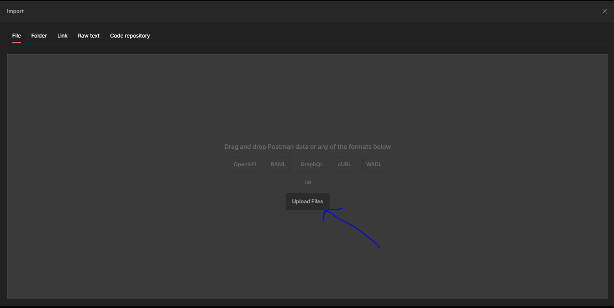
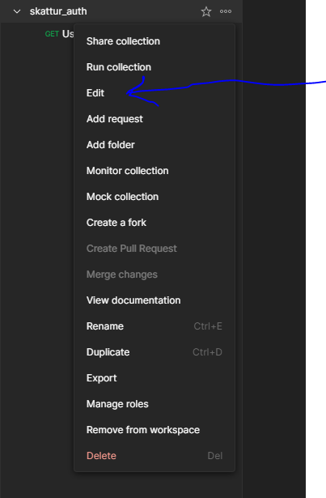

# island.is_postman_collection

Postman collection generator for island.is authentication customers

This repo is a simulation for an extension idea to the application for giving customers access to the authentication system.

From the application, the program will get data and update the standard postman collection with their own values

This process is simulated in a python program in this repo but the idea is to add it to the process the application is made in and send the updated postman collection to
the users

To simulate the process add your own variable values to the file variables.txt
Only change the values on the right side of the character ':'

Once you have done that you can run the python program by opening a shell of your choosing with the following command **py replace_variables.py**

That will generate the new collection to be sent to the customer in the **collections_created** folder

## Postman

Next you need to import your generated collection to postman

Upload the created postman_collection file the python program generated and press the **Import** button

Hover over the created collection -> press the three dot sign and press the **Edit** button

The **Authorization** tab is the functionality for creating the token
The **Variables** tab stores the variables that the customer will create during the application process and the development url

If all the variables are filled in correcly, you should be able to create a token by pressing the **Get New Access Token** button

